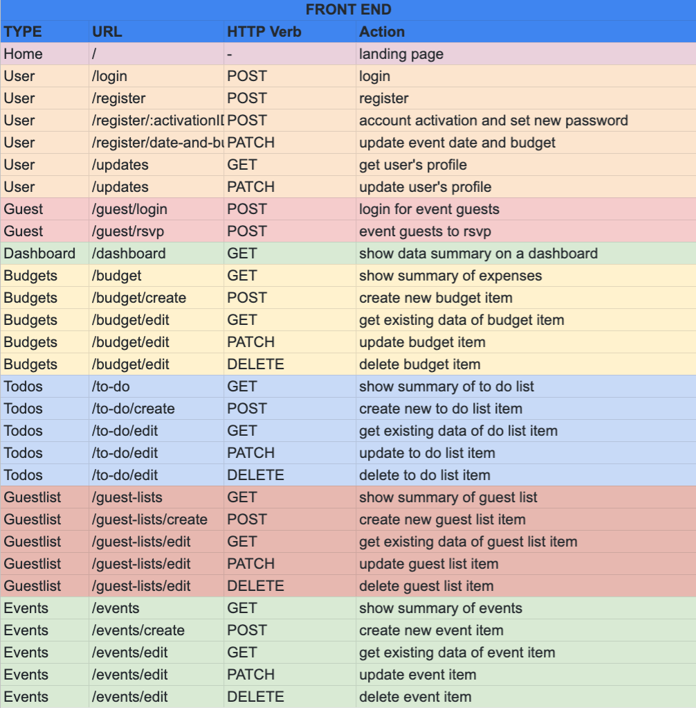
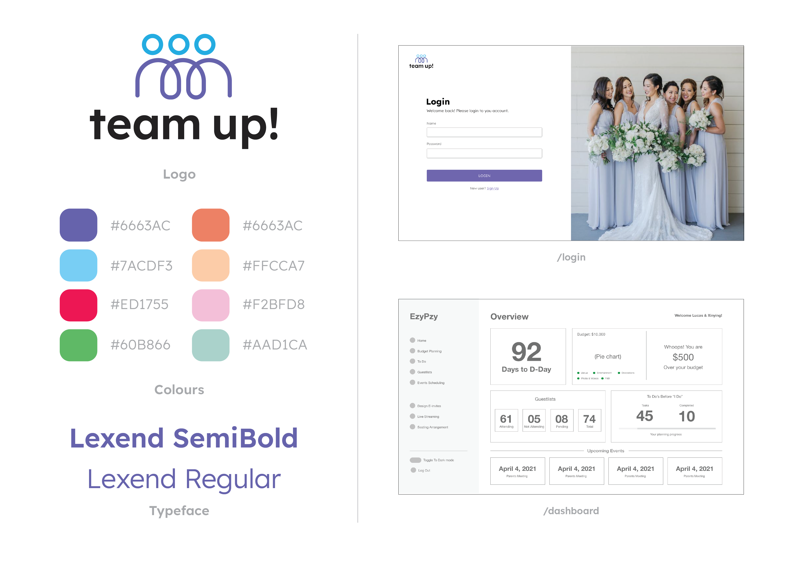
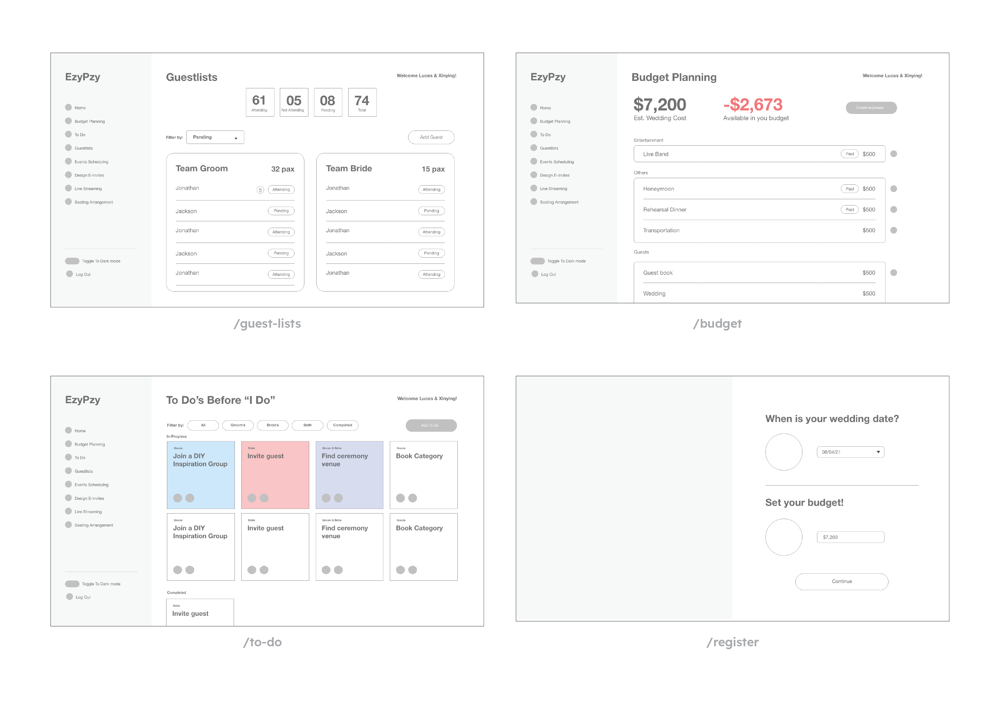
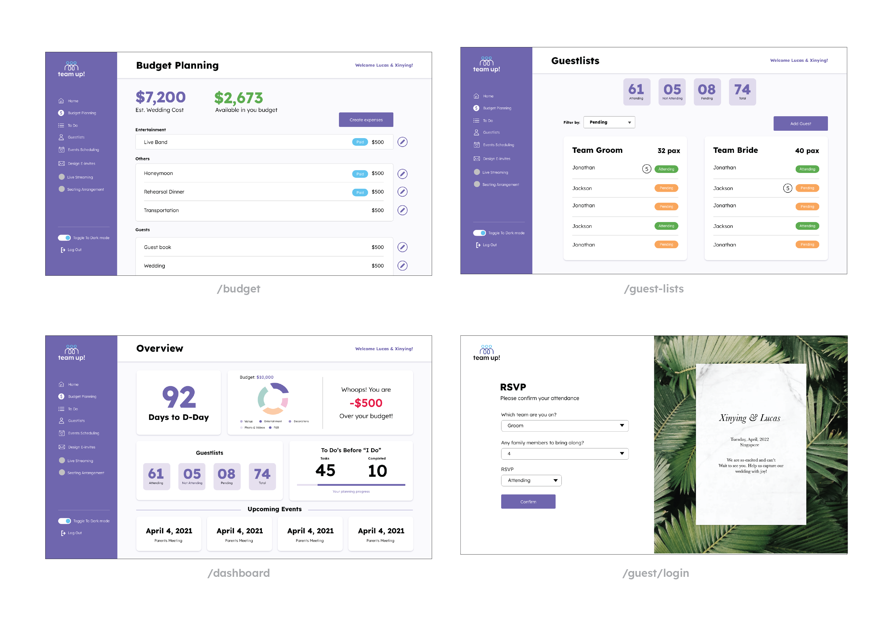

<h1>TeamUp! Back End</h1>

This is a project created to support the <a href="https://teamup-fe.herokuapp.com/">TeamUp</a> web app on the front end.

<h5>OBJECTIVE: An all-in-one App to streamline wedding planning process & Manage your budget at your fingertips. </h5>
  
 <h5> WHO WILL USE THIS: We are looking to target wedding planners, soon to be brides and grooms, and hopefully scale this to a wider target audience with custom event planners in mind</h5>
  

<h2> Application Features </h2>
1. Dashboard  
2. Budget Planning 
3. To-Do List 
4. Guest List Management 
5. Event Schedule 
6. Countdown to D-Date 
7. New User Activation 
8. Guest Login 
9. Guest RSVP 
 

<h2>Technologies used</h2>
- Authorization 
- Mongoose DB 
- MVC 
- Bcrypt 
- Method Override 
- Toastify 
- Material UI 
- Mailgun JS 
- Moment JS 
- AXIOS 
- CORS 
- DOTENV 
- Express: NodeJS Web Development Framework 
- JOI 
- JSON Web Token 
- Lodash 
- randomstring 
- UUID 
- Google Maps API 
 

<h2>Routes / Pages</h2>
<h3>Front End:</h3>

  
<h3>Back End:</h3>

Postman can also be used to access the back end, with the following tables:

<h2>Users</h2>

| **URL** | **Method** | **Actions** |
|------------|-------------|------------|
| /api/v1/users/dashboard        | GET | show user dashboard
| /api/v1/login     | POST | login in user
| /api/v1/register    | POST | register user account
| /api/v1/users/profile   | GET | show user profile      
| /api/v1/users/profile/update   | PATCH | update user profile
| /api/v1/users/profile/delete      | DELETE | delete user
| /api/v1/:userActivationURL      | POST | new user password change

 

<h2>Guests</h2>

| **URL** | **Method** | **Actions** |
|------------|-------------|------------|
| /api/v1/users/guests | GET | show user guest list
| /api/v1/users/guests/create | POST | create user guest item
| /api/v1/users/guests/:guest-item | GET | show guest item
| /api/v1/users/guests/:guest-item/update | PATCH | update guest item     
| /api/v1/users/guest/:guest-item/delete | DELETE | delete guest item
| /api/v1/users/guests/login | POST | guest login
| /api/v1/users/guests/:guest-id/rsvp | PATCH | update guest RSVP

 

<h2>Todos</h2>

| **URL** | **Method** | **Actions** |
|------------|-------------|------------|
| /api/v1/users/todos | GET | show user todo list
| /api/v1/users/todos/create | POST | create user todo item
| /api/v1/users/todos/:todo-item | GET | show todo item
| /api/v1/users/todos/:todo-item/update | PATCH | update todo item     
| /api/v1/users/todos/:todo-item/delete | DELETE | delete todo item

 

<h2>Budgets</h2>

| **URL** | **Method** | **Actions** |
|------------|-------------|------------|
| /api/v1/users/budget | GET | show user budgets list
| /api/v1/users/budget/create | POST | create user budget item
| /api/v1/users/budget/:budget-item | GET | show budget item
| /api/v1/users/budget/:budget-item/update | PATCH | update budget item     
| /api/v1/users/budget/:budget-item/delete | DELETE | delete budget item

 

<h2>Events</h2>

| **URL** | **Method** | **Actions** |
|------------|-------------|------------|
| /api/v1/users/events | GET | show user events list
| /api/v1/users/events/create | POST | create user event item
| /api/v1/users/events/:event-item | GET | show event item
| /api/v1/users/events/:event-item/update | PATCH | update event item     
| /api/v1/users/events/:event-item/delete | DELETE | delete event item

 
 
 
<h2>The Approaches Taken</h2>
1. Research on best practices & competitor analysis 
2. Research on design inspirations  
3. App Name Exploration  
4. Wireframe / Design mock up & logo design 
5. Determine the routes and data needed 
6. Set up database with collections in the MongoDB 
7. Concurrently working on Front User Interface & Back End RESTFUL Routes and CRUD Routes  
8. Deploying Backend on Heroku and Postman 
9. Deploying Front End onto Heroku 
 

<h2>Initial Wireframe & Design</h2>

  
<h2>Unsolved Problems</h2>
1. Design of e-invite 
2. Bugs on Event-Edit Date/ Time input 
3. Dashboard Event Pagination Arrow not working 
4. Budget and Date input after registration - CORS Error 
5. Pie Chart and Dashboard 
6. Dark Mode 
 

<h2>Note to self</h2>
- Further improve on app features e.g. Design e-invites, Dark Mode, Google Map, QR Code 
- Extending to more than just a wedding planner app  
- Overall code clean up and refactoring
 

<h2>Team Members/Collaborators</h2>
1. <a href ="https://github.com/howardleejh/">Howard Lee </a> 
2. <a href ="https://github.com/lucasseet/">Lucas Seet </a> 
3. <a href ="https://github.com/xinyingchua/">Xinying Chua </a> 

 

<h2>Application Front / Back End Deployed on Heroku</h2>
1. <a href ="https://teamup-fe.herokuapp.com/">Teamup Front End
 </a> 
 

<h2>Github Repositories</h2>
1. <a href ="https://github.com/xinyingchua/teamup-fe">Front-End Repo
 </a> 
2. <a href ="https://github.com/howardleejh/teamup-be">Back-End Repo
 </a> 

